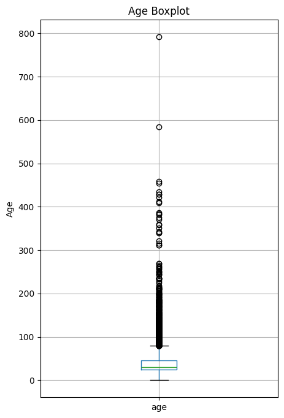
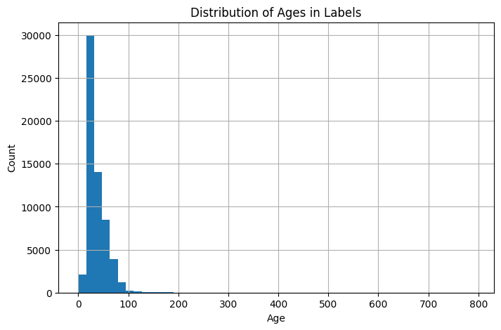

# Age Prediction with Deep Neural Networks

**Author**: Vicente Ramos  
**Date**: 03/02/2025  

## Table of Contents
0. [Getting Started](#getting-started)  
1. [Introduction](#introduction)  
2. [Problem Description](#problem-description)  
3. [Data Preprocessing](#data-preprocessing)  
   - [Data Augmentation & Transforms](#data-augmentation--transforms)  
4. [Model Architectures](#model-architectures)  
   - [CNN Architecture](#cnn-architecture)  
   - [ResNet Regressor Architecture](#resnet-regressor-architecture)  
5. [Training & Hyperparameter Tuning](#training--hyperparameter-tuning)  
   - [Naive Grid Search](#naive-grid-search)  
   - [Ray Tune](#ray-tune)  
   - [Cross-Validation](#cross-validation)  
6. [Experiment Sequence & Results](#experiment-sequence--results)  
   - [Submission History](#submission-history)  
   - [Adjustments & Observations](#adjustments--observations)  
7. [Conclusion](#conclusion)  
8. [References](#references)


## Getting Started

To replicate the results, follow these steps:

### 1. Clone the Repository  
```bash
git clone <repo-url>
cd <repo-folder>
```

### 2. Create a Virtual Environment  
```bash
python -m venv .venv
source .venv/Script/activate
```

### 3. Install Dependencies  
```bash
pip install -r requirements.txt
```

### 4. Download the Dataset  
Download the dataset from Kaggle:  
[Age Prediction Dataset](https://www.kaggle.com/competitions/age-prediction-spring-25-at-cu-denver/data)  

### 5. Clean the Dataset  
- Adjust the dataset root path in **`agepredict/utils/dataset.py`** (Line 120).  
- Run the script to preprocess the data:  
   ```bash
   python agepredict/utils/dataset.py
   ```
- For details on preprocessing, refer to the implementation in `dataset.py`.

### 6. Train the Model  
- Open **`main.py`** (at the root of the repo) and update the root path variable (Line 6).  
- Enable or disable **hyperparameter tuning** with Ray Tune or **cross-validation** by commenting/uncommenting the respective lines.  
- Start training:  
  ```bash
  python main.py
  ```

### 7. Retrieve Results  
The trained model and results will be saved in the specified output directory, check there if something looks off.

## Introduction

Accurate **age prediction** from a single face image has many applications, such as healthcare screening, security checks, and customer analytics. While humans can guess age with moderate accuracy, a deep learning model can capture subtle features (skin texture, facial structure, hair loss, etc.) to provide more precise estimates. This project demonstrates the construction of a robust regression model using **PyTorch**.

Key components include:
- Data cleaning and bounding box checks
- A pretrained ResNet with augmentation
- Early stopping and learning rate scheduling
- Cross-validation for robust performance measurement
- Hyperparameter tuning with Ray Tune

The final pipeline achieves an RMSE of approximately **6.9** on a real-world dataset after filtering out outliers and low-quality samples.


## Problem Description

The project uses the following datasets:
- **`wiki_labels.csv`**: Contains face images with labeled ages, detection confidences (`face_score`), bounding boxes, etc.
- **`wiki_judge.csv`**: A test set with unknown ages for scoring.

**Goal**: Train a model $$ f(\text{image}) \to \text{age} $$ that minimizes the difference between predicted and true ages, measured by the **Root Mean Squared Error (RMSE)**:

$$
\text{RMSE} = \sqrt{\frac{1}{N} \sum_{i=1}^{N} (\hat{y}_i - y_i)^2}
$$

## Data Preprocessing

The quality of the training data was critical to achieving our final performance. The cleaning pipeline applied the following steps:

- **Age Filtering:**  
  Only samples with age between 1 and 100 were retained to remove unrealistic values (such as age 0 or extreme outliers). This ensures that the model learns from meaningful examples.

- **Face Score Filtering:**  
  The face score was converted to numeric and only samples with a face score of at least 1.0 were kept. This step removed 1,288 weak detections, ensuring the model trains on high-confidence face images.

- **Multi-Face Handling:**  
  Approximately 3,963 images with a detected second face were removed to avoid ambiguity. This step ensures that each sample contains a single face for accurate age prediction.

- **Gender Balancing:**  
  The dataset was pretty skewed, about 45,558 males vs. just 12,216 females. To mitigate any bias from this, partial oversampling of the minority class (females) was applied using a factor of approximately 1.8, thereby increasing the representation of females without fully equalizing the counts.

After these adjustments, the final cleaned dataset contained approximately 49,278 images.

**Code Snippet:**
```python
cleaned_df = clean_dataset(
    csv_path="wiki_labels.csv",
    output_csv_path="wiki_labels_clean.csv",
    min_age=1, 
    max_age=100,
    min_face_score=1.0,
    do_balance_gender=True
)
cleaned_df = cleaned_df[cleaned_df["second_face_score"].isna()]
```

**Dataset Visualizations:**

The following images provide visual insights into the dataset after cleaning:
- **Boxplot of Age Distribution:**  
  
- **Histogram of Age Distribution:**  
  

**Dataset Statistics (Extracted from the Raw Data):**
- **Age:**  
  - Count: 60,327  
  - Mean: 36.72  
  - Std: 21.25  
  - Min: 0  
  - Max: 791.79  
- **Gender Distribution:**  
  - Males: 45,558  
  - Females: 12,216  
- **Face Score Analysis:**  
  - Number of images with face score < 1.0: 1,288  
- **Second Face Detected:**  
  - 3,963 images had a second detected face

These preprocessing steps, filtering by age and face score, removing ambiguous multi-face images, and balancing the gender distribution, were essential in cleaning the dataset, which in turn contributed to the final model performance.

### Data Augmentation & Transforms

In addition to the data cleaning, image augmentations help improve model robustness. Training transforms include random cropping, horizontal flipping, slight color jitter, and rotation to expose the model to varied image conditions. In contrast, validation/test transforms are deterministic, typically involving resize and normalization, to ensure consistent evaluation. 

For the full implementation, see `agepredict/utils/transforms.py.`

## Model Architectures

### CNN Architecture  

The CNN consists of three convolutional layers followed by fully connected layers for regression.  

- **Convolutional layers** capture local patterns such as edges and textures.  
- **Max pooling** reduces spatial dimensions while retaining important information.  
- **Fully connected layers** map extracted features to a single age prediction.  
- **ReLU activation** introduces non-linearity for better learning.  

Snippet from the implementation:  
```python
self.conv1 = nn.Conv2d(3, 16, kernel_size=3, stride=1, padding=1)  
self.conv2 = nn.Conv2d(16, 32, kernel_size=3, stride=1, padding=1) 
self.conv3 = nn.Conv2d(32, 64, kernel_size=3, stride=1, padding=1) 
self.fc1 = nn.Linear(64 * 12 * 12, 128)
self.fc2 = nn.Linear(128, num_classes)
```
For the full implementation, refer to: `agepredict/models/cnn.py`.  

### ResNet Regressor Architecture  

The ResNet-based model leverages a **pretrained ResNet-18**, adapting its final layers for regression.  

- **Residual connections** improve gradient flow, making deeper networks more trainable.  
- **Pretrained weights** from ImageNet provide general feature representations useful for age estimation.  
- **Final fully connected layer replaced** with:  
  - **Dropout ($ p = 0.3 $)** to reduce overfitting.  
  - **Linear layer** to output a single age prediction.  
- **Fine-tuning all layers** allows ResNet to adapt specifically to age prediction.  

For the full implementation, refer to: `agepredict/models/resnet.py`.  

### Summary  

- The **CNN model** is lightweight and efficient but lacks depth for nuanced age patterns.  
- **ResNet-18**, pretrained on ImageNet, extracts hierarchical features that improve prediction accuracy.  
- **Fine-tuning all layers** enhances adaptation to the dataset.  
- **Dropout layers** mitigate overfitting in deeper models.  
- **Additional comments** in the code further explain these design choices. 

## Training & Hyperparameter Tuning

### Naive Grid Search

An initial grid search over parameters $\text{lr} \approx 2.2 \times 10^{-4}$, a batch size of 32, and 5–10 epochs.

### Ray Tune

To explore a broader hyperparameter space, Ray Tune was used:


$$
\begin{aligned}
\text{lr} &\in [10^{-5}, 10^{-3}], \\
\text{batch\_size} &\in \{16, 32, 64\}, \\
\text{epochs} &\in \{10, 15, 20\}, \\
\text{early\_stop\_patience} &\in \{3, 5\}.
\end{aligned}
$$

Trials continued until a configuration with:

$$
\begin{aligned}
\text{lr} &\approx 2.2 \times 10^{-4}, \\
\text{batch\_size} &= 16, \\
\text{max epochs} &= 20 \quad \text{(early stopped at } \sim 6), \\
\text{patience} &= 3.
\end{aligned}
$$


gave us a best single-run RMSE of **6.69**. The **cross-validation** average was around **9.0**, confirming the model's stability.


### Cross-Validation

A 5-fold cross-validation was implemented:
- The dataset was split into 5 folds.
- For each trial, 4 folds were used for training and 1 for validation.
- The RMSE was averaged across all folds to ensure robustness.
- Cross-validation landed around 9.0 RMSE, but the best single-run hit **6.6937**. Not bad, but there's probably still room for improvement.

## Experiment Sequence & Results

### Submission History

Multiple attempts were made:
1. **Simple CNN (Baseline)**  
   - Minimal cleaning and tuning; RMSE ≈ 12.82.
2. **ResNet (Unrefined)**  
   - Default hyperparameters, no outlier removal; RMSE ≈ 12.39.
3. **Simple CNN with Basic Tuning**  
   - RMSE ≈ 11.85.
4. **ResNet with Data Cleaning**  
   - Removed extreme ages and low face scores; RMSE ≈ 10.68.
5. **ResNet with Extended Cleaning + Ray Tune**  
   - Refined bounding box filtering and hyperparameter selection; RMSE ≈ 9.0–9.3.
6. **ResNet with Cross-Validation**  
   - Achieved stable performance with an average RMSE around 9.0.

I did a few more submission but I did not implement new approaches. Mostly modified those last submisison by relaxing some filters and balancing genders, the best single-run model reached an RMSE of **6.6937**.


- Data cleaning has the largest impact on performance.
- Ray Tune helped dial in the best hyperparameters, way better than manually guessing lr,batch_size,etc.lr,batch_size,etc..
- Cross-validation confirms that the improvements are robust across different splits.
- The near **6.6937**–9.0 RMSE is likely close to the limit imposed by label noise unless additional data or model complexity is introduced.

### Adjustments & Observations

After a bunch of tests and tweaks, here’s what actually worked:

- **Data Cleaning**:  
  Retained only samples with ages between 1 and 100, a face score of at least 1.0, and excluded images with multiple detected faces. This resulted in a curated dataset of approximately 49,278 images with improved gender balance through partial oversampling.

- **Model Configuration**:  
  Adapted a pretrained ResNet-18 for regression by replacing its final layer with a dropout (p = 0.3) and a linear layer. Hyperparameter tuning led to a learning rate of ~1.86×10⁻⁴, a batch size of 128, and early stopping after 6 epochs, with training capped at 20 epochs.

- **Performance**:  
  The model’s RMSE dropped sharply, from over 23 in the first epoch to about 8.4–8.45 in later epochs, with cross-validation averaging near 9.0 and the best single run reaching approximately **6.6937**.

These refinements in data preprocessing and model tuning have significantly enhanced performance. Future improvements may include exploring larger architectures, incorporating additional metadata, or employing ensemble methods.

## Conclusion

In this project, I tackled **age prediction** by combining a heavily cleaned face dataset with a finely tuned ResNet model. Our pipeline includes:

1. **Data Cleaning**:  
   - Bounding box area filtering, `face_score >= 1.0`, and removal of ages outside the 1 to 100 range.
   - Gender balancing via partial oversampling.
2. **Transform Enhancements**:  
   - Use of random rotation, color jitter, and random cropping.
3. **Cross-Validation**:  
   - To provide a robust average RMSE and ensure generalization.
4. **Hyperparameter Tuning**:  
   - An initial grid search followed by Ray Tune, leading to a final configuration with $ \text{lr} \approx 2.2 \times 10^{-4} $ , a batch size of 16, and 20 epochs.
5. **Final RMSE**:  
   - Around **6.6937** (LOCAL) on the validation set, with cross-validation averages near 9.0.

The project demonstrates that high-quality data and systematic tuning are crucial for success. Future improvements may include:
- Using larger backbones (ResNet50, EfficientNet)
- Incorporating additional metadata into the model
- Employing ensemble methods to further reduce RMSE

## References

1. **He, K., Zhang, X., Ren, S., & Sun, J.** (2016). *Deep Residual Learning for Image Recognition*. In *Proceedings of the IEEE Conference on Computer Vision and Pattern Recognition* (pp. 770-778).  
2. **Krizhevsky, A., Sutskever, I., & Hinton, G. E.** (2012). *ImageNet Classification with Deep Convolutional Neural Networks*. *Communications of the ACM, 60*(6), 84-90.  
3. **Goodfellow, I., Bengio, Y., & Courville, A.** (2016). *Deep Learning*. MIT Press.  
4. **Howard, J., & Gugger, S.** (2020). *Fastai: A Layered API for Deep Learning*. *Information, 11*(2), 108.  
5. **Ray Tune Documentation**: [https://docs.ray.io/en/latest/tune/index.html](https://docs.ray.io/en/latest/tune/index.html)

